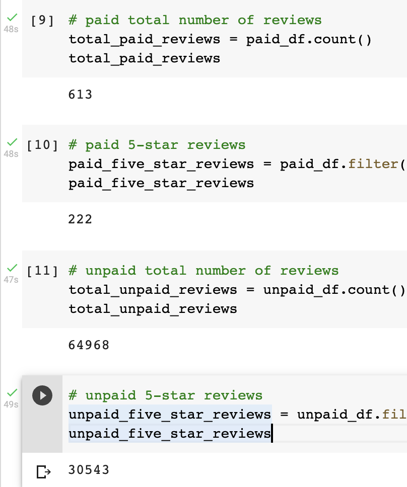
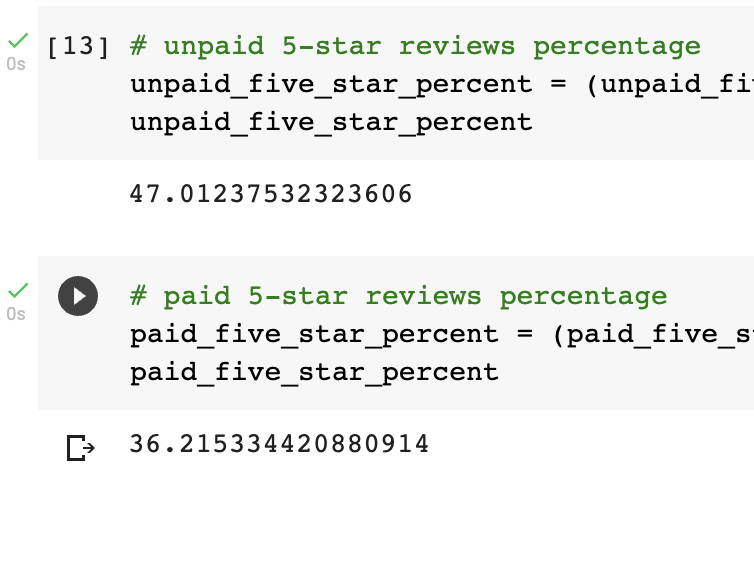

# Amazon_Vine_Analysis

## Overview of the analysis

In this analysis we Perform ETL on Amazon Product Reviews and Determine Bias of Vine Reviews. 

## Resources

Data Source: Amazon Review datasets, https://s3.amazonaws.com/amazon-reviews-pds/tsv/amazon_reviews_us_Wireless_v1_00.tsv.gz

Software: Google Colab Notebook, PostgreSQL 11.9, pgAdmin 4, AWS

## Results

How many Vine reviews were there?

- 613

How many non-Vine reviews were there?

- 64968

How many Vine reviews were 5 stars?

- 222

 How many non-Vine reviews were 5 stars?

 - 30543

What percentage of Vine reviews were 5 stars? 

- 36%

What percentage of non-Vine reviews were 5 stars?

- 47%

## Summary

There is not a high positivity bias for reviews in the Vine program because the non-Vine rewies is 47% and Vine rewiews just 36%. 
An additional analysis could be mean/median for the star rating for the Vine and non-Vine reviews.
